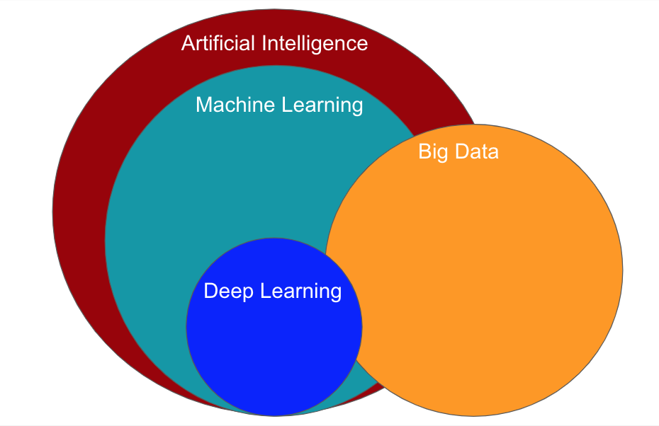
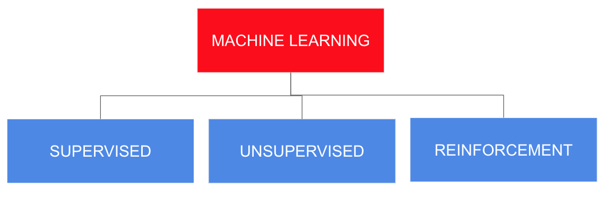
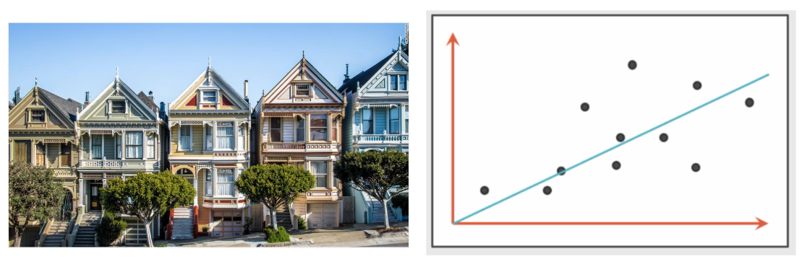
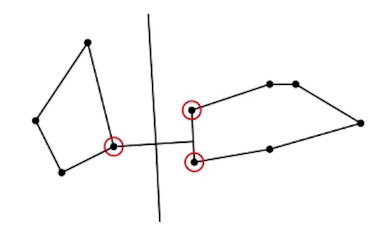
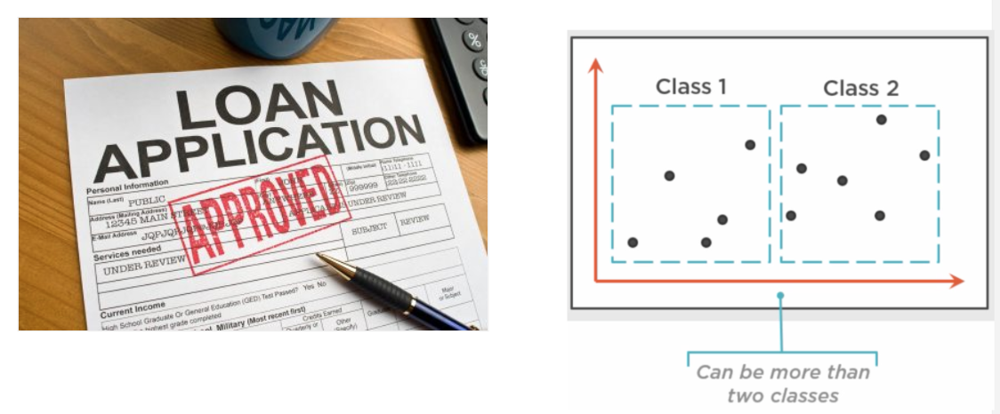

## Machine Learning vs Deep Learning

Generally speaking, in this Webinar we are going to learn that Deep Learning is a subset of Machine Learning.

In order to know the important things of these areas of Artificial Intelligence we we need to understand concepts
such as:

* Definitions, Approaches and Algorithms of Machine Learning

* Definitions, Neural Networks, Architectures of Deep Learning.

### Approaches of Machine Learning

### Linear Regression

### Support Vector Machine

### kNN
>Pseudo Code:

>for every point in our dataset:
    calculate the distance between the current point and input_vector
    sort the distances in increasing order
    take k items with lowest disances to input_vector
    find the majority class among these items
    return the majority class label from the k closest neighbors

After completing the theory part, we are going to show two real-world problems from Machine Learning and Deep Learning.

Hope you enjoy this Webinar!

Thanks.