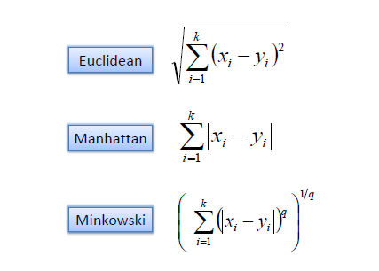
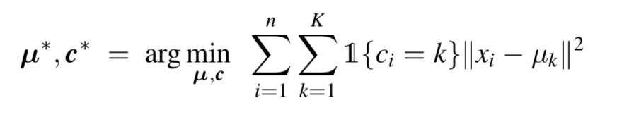
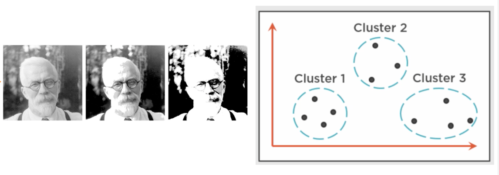
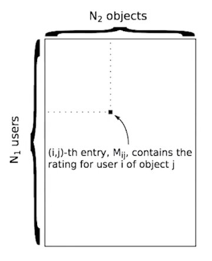
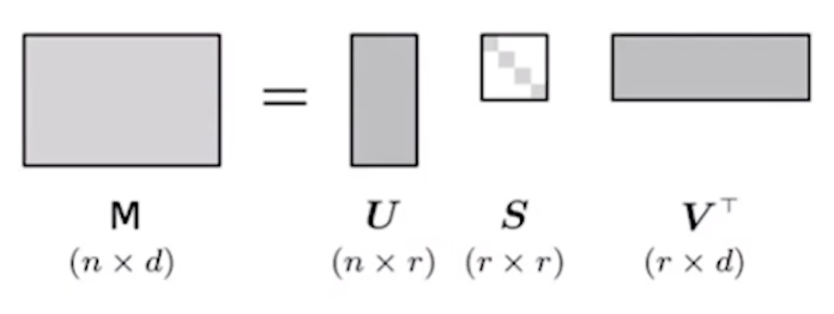
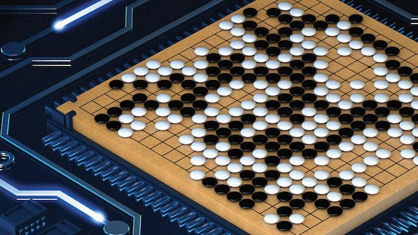
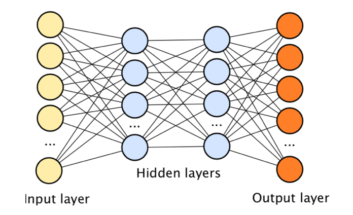
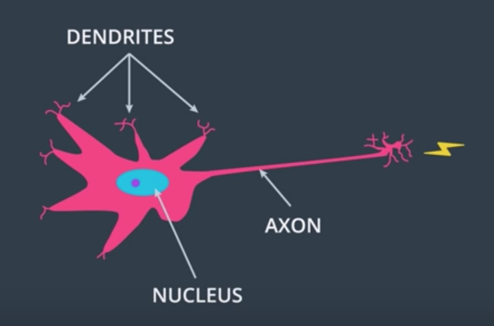
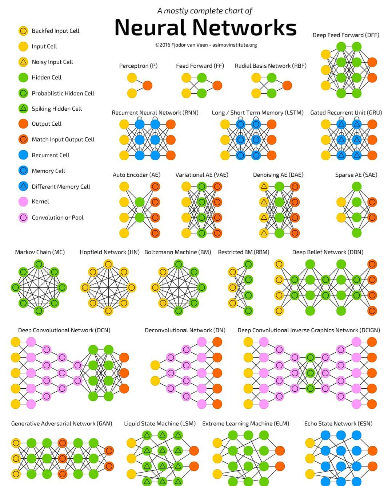

## Machine Learning vs Deep Learning

Generally speaking, in this Webinar we are going to learn that Deep Learning is a subset of Machine Learning and when to apply Machine Learning (Prediction based on Historical Data) and Deep Learning (Prediction applications in: Image Recognition, object Detection, etc.)

In order to know the important things of these areas of Artificial Intelligence we we need to understand concepts
such as:

* Definitions, Approaches and Algorithms of Machine Learning

* Definitions, Neural Networks, Architectures of Deep Learning.


### 1.- Approaches of Machine Learning


### [2.- Linear Regression](https://en.wikipedia.org/wiki/Linear_regression)

See [Predicting House's price using Linear Regression](https://github.com/Marvinsky/machine_learning_vs_deep_learning/blob/master/Predicting%20House's%20price%20using%20Linear%20Regression.ipynb)


### 3.- Classification


#### [3.1.- Support Vector Machine](https://towardsdatascience.com/support-vector-machine-introduction-to-machine-learning-algorithms-934a444fca47)


##### Clustering Distance



#### [3.2.- K-Nearest Neighbors (KNN)](https://www.analyticsvidhya.com/blog/2018/03/introduction-k-neighbours-algorithm-clustering/)

>Pseudo Code:
```
for every point in our dataset:
    calculate the distance between the current point and input_vector
    sort the distances in increasing order
    take k items with lowest disances to input_vector
    find the majority class among these items
    return the majority class label from the k closest neighbors
```

### [4.- Clustering](https://en.wikipedia.org/wiki/K-means_clustering)

#### 4.1.- K-means

##### Optimization Function



##### Lossy Data Compression




### [5.- Recommendation Systems](https://en.wikipedia.org/wiki/Recommender_system)

#### 5.1.- Matrix Factorization



#### 5.3.- Singular Value Decomposition



### [6.- Deep Reinforcement Learning Systems](https://deepmind.com/research/dqn/)

#### 6.1.- Atari Game

See [Pong AI with Policy Gradients](https://www.youtube.com/watch?time_continue=53&v=YOW8m2YGtRg)

#### 6.2.- DeepMind - AlphaGo vs Lee Sedol

 

### 7.- Deep Learning

See [Image Classification - Multi-Layer Perceptron - MNIST](https://github.com/Marvinsky/machine_learning_vs_deep_learning/blob/master/Image%20Classification%20-%20Multi-Layer%20Perceptron%20-%20MNIST.ipynb)

#### 7.1.- What is it used for?

Pretty much, everywhere. Recent applications include things such as beating humans in games such as Go, or even jeopardy, detecting spam in emails, forecasting stock prices, recognizing images in a picture, and even diagnosing illnesses with more precision than doctors. One of the most celebrated applications in deep learning is self-driving cars. 

What is the heart of deep learning? The wonderful object called Neural Networks. Neural Networks mimic the process of how the brain operates, with neurons that fire bits of information. 

#### 7.2.- Neural Network

  

#### 7.2.- Perceptron

  

#### 7.3.- Architectures



#### 7.3.- More Applications

* Train AI to talk [WaveNet](https://deepmind.com/blog/wavenet-generative-model-raw-audio/)

* CNN for [text classification](http://www.wildml.com/2015/12/implementing-a-cnn-for-text-classification-in-tensorflow/)

* Pictionary with CNN: [QuickDraw](https://quickdraw.withgoogle.com/#)

* Intelligent Flying Machines [IFM](https://www.youtube.com/watch?v=AMDiR61f86Y)

* Natural Neural Network to change your look: [FaceApp](https://www.digitaltrends.com/photography/faceapp-neural-net-image-editing/)


After completing the theory part, we are going to show two real-world problems from Machine Learning and Deep Learning.

Hope you enjoy this Webinar!

Thanks.